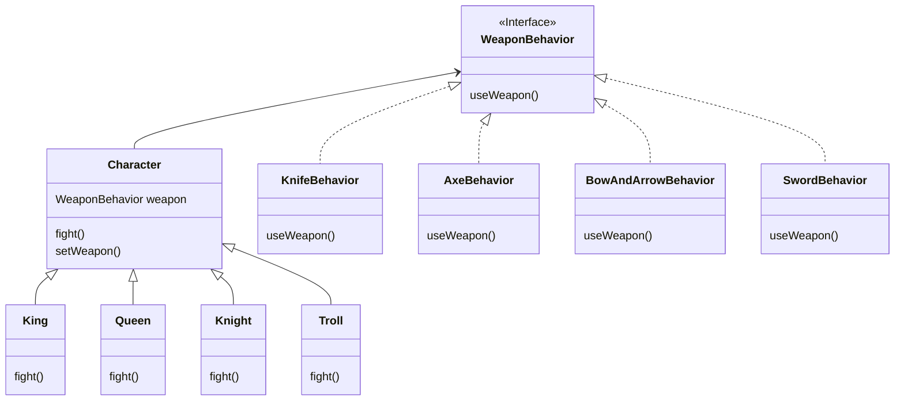

```mermaid
classDiagram
    class Character
    Character: WeaponBehavior weapon
    Character: fight()
    Character: setWeapon()
    Character <|-- King
    King: fight()
    Character <|-- Queen
    Queen: fight()
    Character <|-- Knight
    Knight: fight()
    Character <|-- Troll
    Troll: fight()
    class WeaponBehavior
    << Interface >> WeaponBehavior
    WeaponBehavior: useWeapon()
    WeaponBehavior <-- Character
    WeaponBehavior <|.. KnifeBehavior
    KnifeBehavior: useWeapon()
    WeaponBehavior <|.. AxeBehavior
    AxeBehavior: useWeapon()
    WeaponBehavior <|.. BowAndArrowBehavior
    BowAndArrowBehavior: useWeapon()
    WeaponBehavior <|.. SwordBehavior
    SwordBehavior: useWeapon()
```